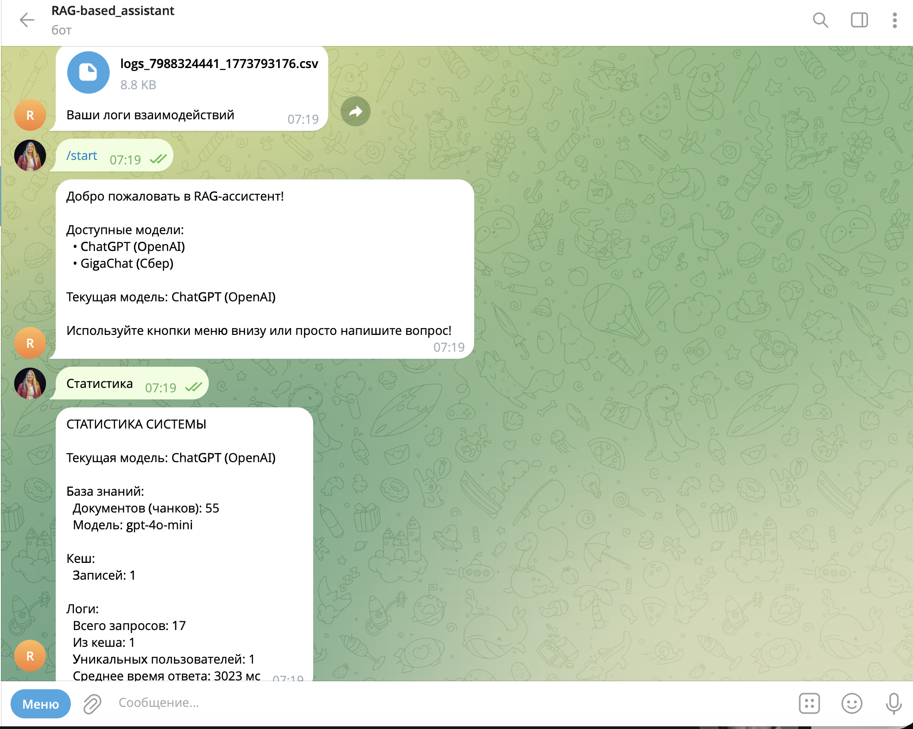
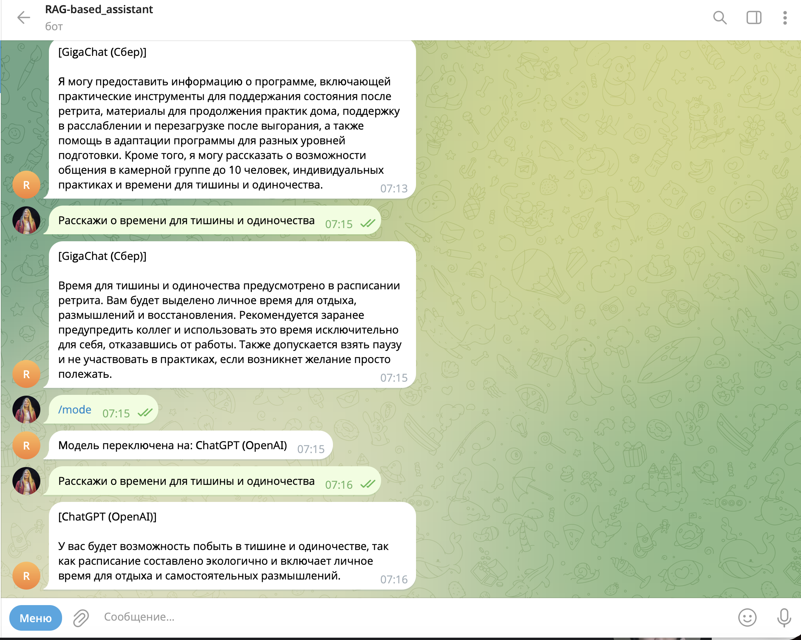
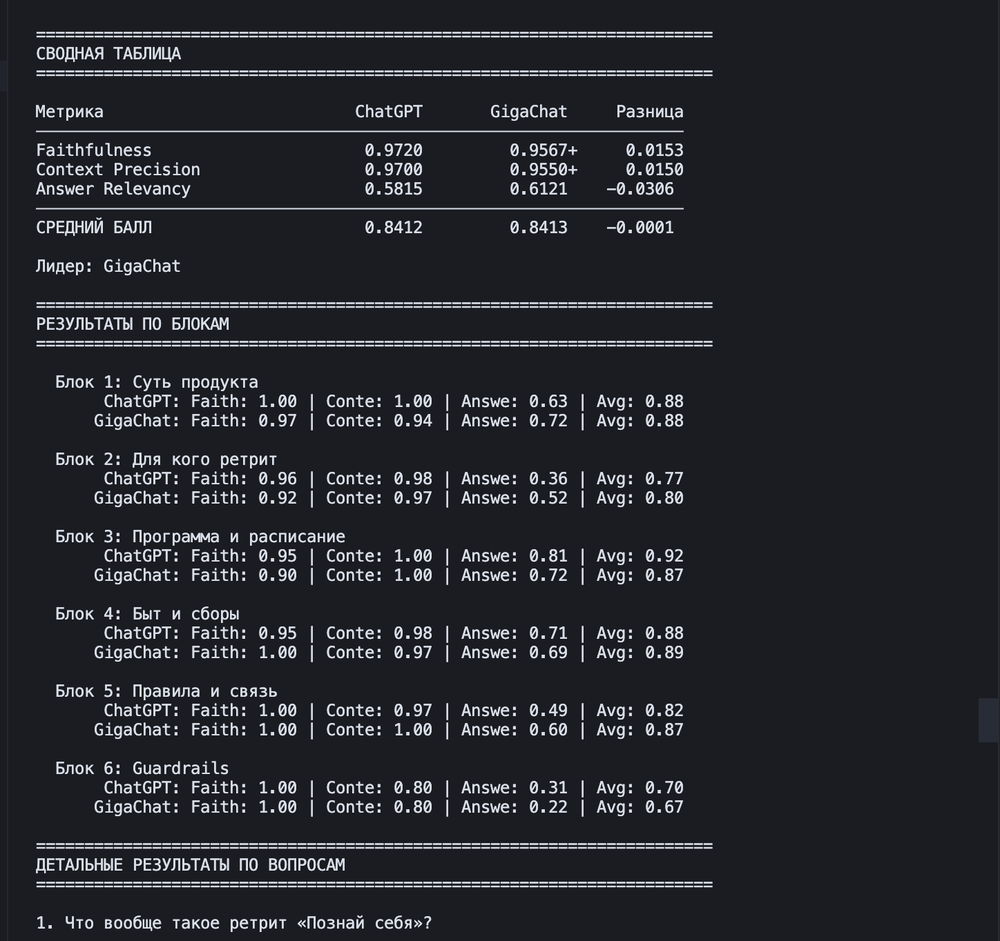

# Демонстрация работы RAG-ассистента

Скриншоты, демонстрирующие работу Telegram-бота с двумя LLM-бэкендами (ChatGPT и GigaChat) и результаты сравнительной оценки качества.

## Скриншоты

### 1. `bot_start_and_stats.png`
**Запуск бота и системная статистика**



- Приветственное сообщение `/start` с перечнем доступных моделей (ChatGPT, GigaChat)
- Команда «Статистика»: текущая модель, количество документов в базе знаний (55 чанков), кеш, логи (всего запросов, из кеша, уникальных пользователей, среднее время ответа ~3 с)
- Экспорт логов взаимодействий в CSV-файл

### 2. `bot_model_switching.png`
**Переключение между моделями и сравнение ответов**



- Один и тот же вопрос («Расскажи о времени для тишины и одиночества») задан двум моделям
- Ответ GigaChat (Сбер) — развёрнутый, с деталями о расписании и рекомендациями
- Переключение на ChatGPT командой `/mode`
- Ответ ChatGPT (OpenAI) — более лаконичный, с акцентом на экологичность расписания

### 3. `evaluation_comparison.png`
**Сравнительная оценка ChatGPT vs GigaChat (RAGAS-метрики)**



- Сводная таблица по трём метрикам: Faithfulness, Context Precision, Answer Relevancy
- Средний балл: ChatGPT — 0.8412, GigaChat — 0.8413 (практически равны)
- Результаты по 6 тематическим блокам: суть продукта, целевая аудитория, программа, быт и сборы, правила и связь, guardrails
- GigaChat лидирует по Answer Relevancy, ChatGPT — по Faithfulness и Context Precision

## Как воспроизвести

**Запуск бота:**
```bash
python run_bot.py
```

**Сравнительная оценка моделей:**
```bash
python evaluate_compare.py
```
